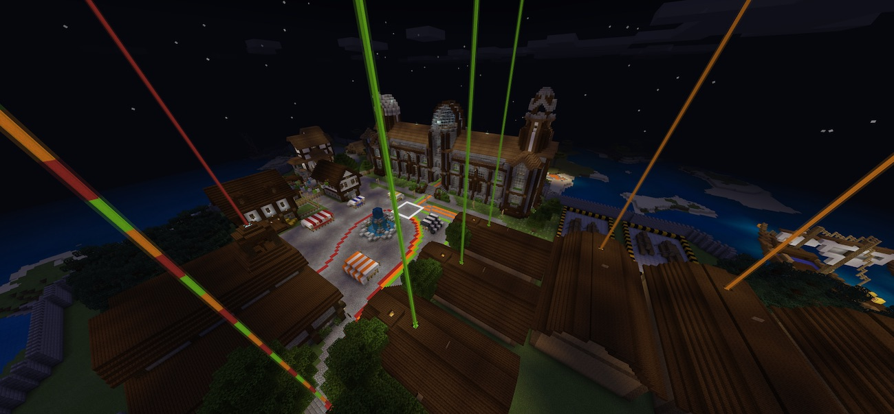
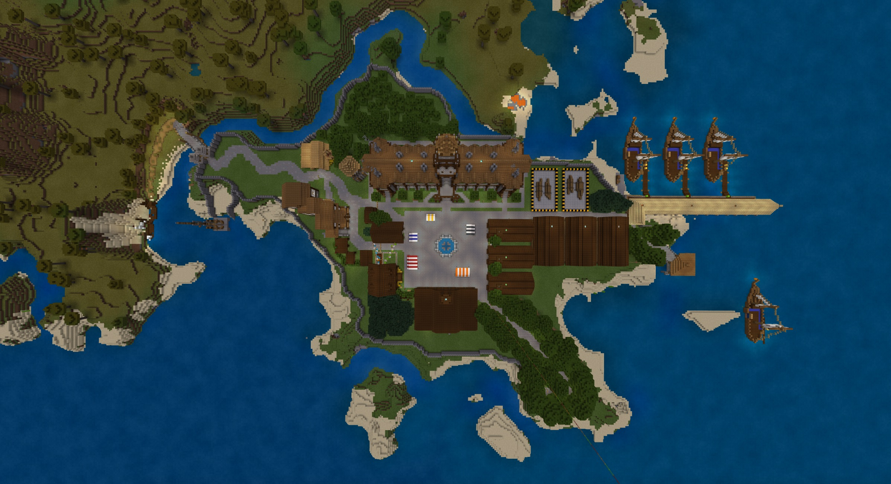
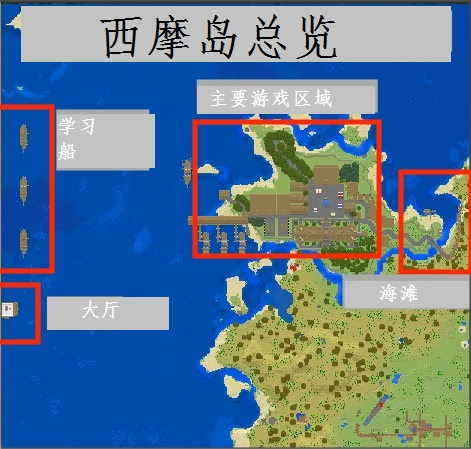

# 老师指南
   
   
欢迎来到西摩岛教学！这本指南包含一些管理西摩岛世界的信息。
   
首先，看一下细节
- 一次最多支持30名玩家（包括教师）。
- 世界支持“虚拟组合”。这可能是两个学生坐在一起，或在他们自己通过微信实时交流。
- 就算是单人任务也允许学生们互相帮助。
- 多人游戏任务要事先分配好组合。
- 总共有9个任务（每个任务有2-3个副本），另外加上学生初始化世界任务0。这9项任务包含：
- 6个单人任务。
- 3个多人任务。


## 允许您管理游戏的命令   
下面，您将学会一些命令，这些命令可以方便的管理游戏。有些是通用的我的世界命令，有些是自定义的功能.   

#### 通用命令
-传送学生：```/tp 玩家名```
-传送一个学生到你这：```/tp 玩家名 你的名字```
-清除所有玩家库存：``/clear @a```
-给一个玩家一个替换的火焰棒：```/give 玩家名 blaze_rod```
-切换到创造（飞行）模式：```/gamemode c```
-将所有玩家切换到冒险模式：``/gamemode @a a```


#### 西摩岛特有命令
- 传送到大厅（靠近船队）: ```/function lobby```
- 传送到控制室（在镇上）: ```/function control```
- 重置所有世界设置 : ```/function settings```
- 重置/设置世界评分系统 : ```/function reset_scores```
- 加载world builder工具箱 : ```/function tools```

## Makecode programs
- 启动学生分配器（上船） - https://makecode.com/_227c9AeKXP3h

## 地图
### 学生地图
这张地图包括学生的任务。他们可以通过和镇长谈话来了解这个世界.   


### 教师概况图
这张地图是为教师们更好地了解世界概况而设计的.    

