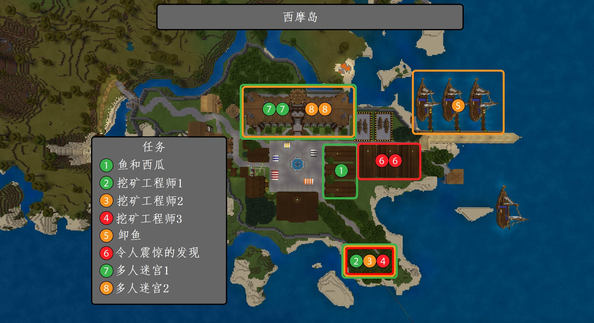

# Teacher Guide
   
   
Welcome to Seymour Island fellow educator! This guide contains a few useful pieces of information for running the Seymour Island world.   
   
First, some specifics   
- The world supports up to 30 players at once (including the teacher/s).
- The world is designed to be done in "virtual pairs". These could be 2 students sitting beside each other, or in their own call.   
    - Although not 100% necessary, it allows students to assist each other, even if a number of the tasks are actually single player.   
    - It also makes the multiplayer tasks a lot easier to already have pre-assigned pairs.   
- There are 9 total unique tasks (each with 2-3 copies), plus the initial task 0, which is copied for each player. These 9 tasks break out to:   
    - 6 single player tasks.
    - 3 multiplayer tasks.   


## Commands to allow you to manage the game   
Below, you will find a few commands that will make managing this game a whole lot easier. Some are generic Minecraft, others are custom functions.   

#### Generic commands
- Teleport to a student : ```/tp STUDENTNAME```
- Teleport a student to you : ```/tp STUDENTNAME YOURNAME```
- Clearing all players inventories : ```/clear @a```
- Giving a player a replacement blaze rod : ```/give PLAYERNAME blaze_rod```


#### Seymour Island specific commands
- Teleport to the lobby (near the ship fleet) : ```/function lobby```
- Teleport to the control room (in the town) : ```/function control```
- Reset all the world settings : ```/function settings```
- Reset/Setup world score system : ```/function reset_scores```
- Load world builder tools chest : ```/function tools```

## Makecode programs
- Starting student allocator (out onto boats) - https://makecode.com/_227c9AeKXP3h

## Maps
### Student map
This map includes the tasks for the students. They can get access to this in the world by talking to the Mayor in the town.   


### Teacher overview map
This map is designed for teachers to better understand the overview of the world.    
